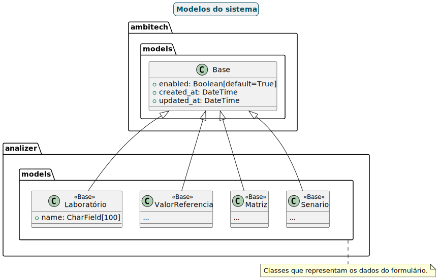

# AmbiTECH

## TODO

- [ ] Modelar interface de usuário.
  - [ ] Criar tela de login.
  - [ ] Criar formulário para upload de arquivos excel.
- [ ] Adicionar o Django ao projeto.
- [ ] Refatorar o código para pegar o arquivo excel do banco de dados, não mais do github.
- [ ] Criar tela de login
- [ ] Criar tela com formulário incremental para o usuário adicionar o arquivo excel e escolher entre as opções disponíveis.
  - [ ] Criar componente para upload de arquivos excel.
  - [ ] Adicionar tabela com preview dos dados do arquivo excel.
  - [ ] Adicionar input para o usuário escolher o nome do arquivo que será gerado.
  - [ ] Mostrar as opções de laboratórios disponíveis e quantidade de valores orientadores.
  - [ ] Mostrar opções de valores de referência conforme escolha anterior, 2, 3 valores.
  - [ ] Mostrar opções de matriz e/ou cenário ambiental para cada valor orientador.
  - [ ] Botão para gerar analise.

## Tecnologias

- Backend:
  - Python 3.13
  - Django 5.x
- Frontend:
  - Vite 4.x
  - Tailwindcss 3.4.x
  - Chadcn/ui 2.1.x
- Banco de dados:
  - PostgreSQL 16.x
- Infraestrutura:
  - Docker
  - Docker Compose

## Tabelas do banco de dados

### Dúvidas

- Precisa ter funcionalidade de esqueci minha senha?
  - Se sim, precisamos de um serviço de email.
- O arquivo gerado no final do processo deve ser enviado por email para o cliente?
  - Se sim, precisamos de um serviço de email.
- Hoje a plataforma apresenta duas opções para quantidade de valores orientadores, 2 e 3. Precisamos de mais opções?
